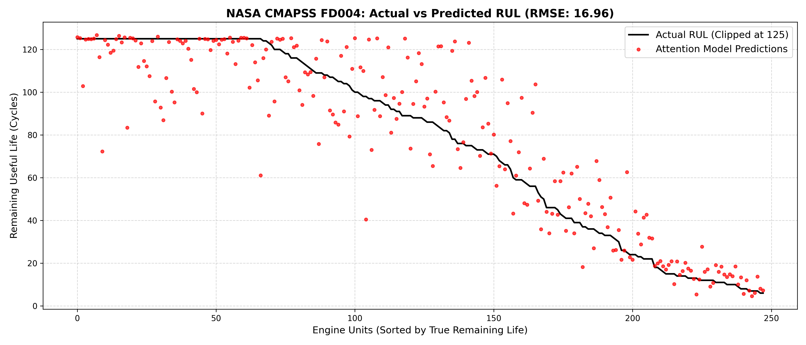

This repository contains my end-to-end Machine Learning pipeline for **Predictive Maintenance (PdM)**. Using the notoriously difficult NASA CMAPSS dataset, I engineered a deep learning architecture that predicts the Remaining Useful Life (RUL) of turbofan engines right up to the point of catastrophic failure. 

## 🧠 The Engineering Journey: Building the Architecture
1. **The Spatial Scanner (1D-CNN):** I started with 1D Convolutions to scan 50-cycle sensor windows. It was great at spotting immediate anomalies, but it lacked "memory" of the engine's long-term wear and tear.
2. **The Temporal Upgrade (LSTM):** I fed the CNN features into a 2-layer LSTM. The model could now understand the *story* of the degradation, dropping the error significantly on simple datasets (FD001).
3. **The Noise Filter (Multi-Head Self-Attention):** When I moved to the complex datasets (FD002 & FD004), the planes were changing altitudes and throttle settings, causing massive sensor spikes. I integrated a **Self-Attention Mechanism** so the model could dynamically assign mathematical weights to the sequence. It successfully learned to ignore flight-regime "noise" and focus purely on actual engine degradation.

## 🛠️ Smarter Data, Not Just Bigger Models
Throwing raw data at a neural network rarely works in industrial environments. I implemented two research-grade preprocessing techniques:
* **Piecewise RUL Labeling:** Real-world engines don't degrade linearly from day one. I capped the target RUL at **125 cycles** so the model wouldn't waste time hunting for damage in perfectly healthy engines.
* **Regime-Aware Normalization (K-Means):** FD004 has 6 entirely different flight regimes overlapping with 2 distinct fault modes. I used K-Means clustering ($k=6$) to dynamically identify the flight condition and applied `StandardScaler` independently to each cluster. 

## 💻 MLOps: The Hardware Hustle
* Using **Automatic Mixed Precision (FP16)** and PyTorch `GradScaler` to speed up the forward pass.
* Implementing the **8-bit Adam Optimizer** (`bitsandbytes`) to compress optimizer states, saving ~75% of my VRAM and allowing me to push batch sizes up to 1024.
* Writing a custom `ReduceLROnPlateau` scheduler to achieve perfect convergence without manual tuning.

## 📊 The Benchmark Results
| Dataset | Complexity | My Architecture | Final Accuracy (Clipped RMSE) |
| :--- | :--- | :--- | :--- |
| **FD001** | 1 Regime, 1 Fault | CNN-LSTM | **26.68 Cycles** |
| **FD002** | 6 Regimes, 1 Fault | CNN-LSTM-Attention | **17.35 Cycles** |
| **FD004** | 6 Regimes, 2 Faults| CNN-LSTM-Attention | **16.96 Cycles** |

As seen in the graph, the model tightly hugs the true degradation curve exactly when it matters most: the final 50 cycles before total engine failure.

## 🚀 How to Run It

1. Clone this repo and drop the NASA CMAPSS `.txt` files into the root directory.
2. Install dependencies: `pip install torch pandas numpy scikit-learn matplotlib bitsandbytes tqdm`
3. Train the Brain: `python base.py`
4. Run the Blind Test: `python test_brain.py`
